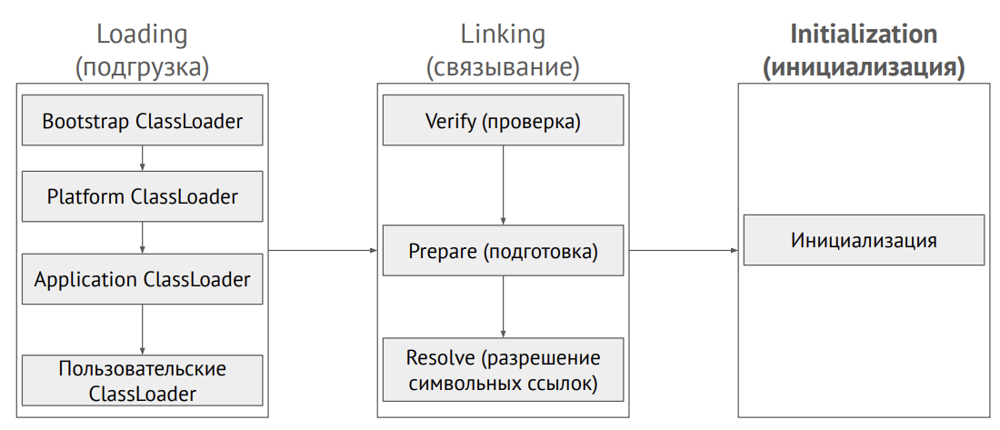
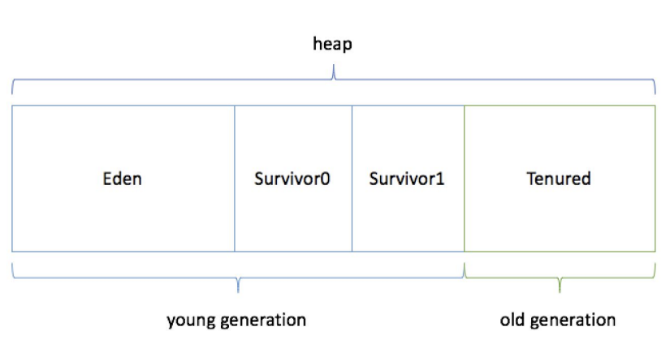

# Домашнее задание по теме «JVM. Организация памяти, сборщики мусора, VisualVM»


### ClassLoader
Для загрузки класс JvmComprehension передается в систему ClassLoader,
состоящий из подсистем:  
Loading > Linking > Initialization.  
В свою очередь, каждая из подсистем соситоит из:

Подсистема Loading ищет подгружаемый файл. Сначала в общих библиотеках Java, если данного класса там нет,
то поиск осуществляется уже непосредственно среди классов созданных в рамках нашей программы.
После нахождения, класс передается в подсистему Linking. Она осуществляет следуюущие действия:

- проверяет, что код в классе валиден,
- подготавливает примитивы в статических полях,
- связывает ссылки с другими классами.

Далее в Initialization выполняется инициализаторы static и инициализаторы полей static.
После осуществления всех вышеперечисленных манипуляций, ClassLoader загружает наш класс в область памяти Metaspace.

### Области памяти
Память делится на Stack Memory и heap (куча).
- при вызове метода класса в Stack будет создан фрейм, в котором будут хранится значения примитивов и ссылки на объекты,
- в heap будут хранится объекты.


**Рассмотрим следующий пример**

```
public class JvmComprehension {

    public static void main(String[] args) {
        int i = 1;                      // 1
        Object o = new Object();        // 2
        Integer ii = 2;                 // 3
        printAll(o, i, ii);             // 4
        System.out.println("finished"); // 7
    }

    private static void printAll(Object o, int i, Integer ii) {
        Integer uselessVar = 700;                   // 5
        System.out.println(o.toString() + i + ii);  // 6
    }
}
```

В момент вызова метода main создается фрейм в Stack.

1. Во фрейме main создается переменная int i со значением 1
2. В Куче создается объект Object и во фрейме main создается переменная о,
   которой присваивается ссылка на этот объект
3. В Куче создается объект Integer со значением 2, а во фрейме main появляется
   переменная ii со ссылкой на этот объект
4. В Stack создается фрейм printAll:
    - во фрейме printAll записывается переменная i, которой присваивается значение
      переменной i из фрейма main,
    - также во фрейме printAll создаются перменные o и i1, которым из фремйа main
      передаются ссылки, которые содержатся в переменных o и i1,
5. В Куче создается объект Integer со значением 700, а во фрейме printAll
   появляется переменная uselessVar со ссылкой на этот объект
6. - В Stack создается фрейм println, в куче создается String(`o.toString() + i + ii`),
     который состоит из значений переданных по ссылкам.
   - Далее ссылка на этот новый String    передается во фрейм printAll.
   - Также параллельно создается в Stack фрейм toString (метод, который преобразовывает объект в String)
   - И далее уже знакомые действия: в куче создается String, который содержит объект `o`,
     переведенный в строку.
   - И ссылка на этот String сохраняется во фрейме printAll.
   - По завершению этого метода происходит очистка и все объекты в куче, которые были созданы при вызове этого метода и более на них никто не ссылается, будут удалены.
7. В данном пункте не очень уверен: либо в Stack создается новый фрейм println, либо в уже созданный ранее фрейм
   `(склоняюсь больше ко второму варианту, ведь в классе не может быть создано два метода с одинаковым названием, а значит и в Stack не должно быть два фрейма с одинаковым названием)`  
   передается ссылка на созданный в куче объект String со значением "finished"

### Garbage Collector
Процесс сборки мусора проходит в несколько этапов.
Heap (куча) имеет определенную иерархию по старшинству объектов.



В кратце - чем больше проверок на удаление прошел объект, тем он старше.
По достижению определнного "возраста" объект переходит на следующую ступень и так далее
Eden > Survivor0 > Survivor1 > Tenured.

Если рассмотреть более подробно, то вновь созданные объекты начинают свой путь в
Young Generation. Young Generation подразделяется на Eden, где начинаются все новые объекты, и два
пространства Survivor, куда объекты перемещаются из Eden. У каждого объекта есть счетчик прохождения сбора мусора.
Как только счетчик достигает определнного значения - объект перемещается из Eden в Survivor0, далее в Survivor1 и наконец в Tenured

**Принцип работы Garbage Collector:**
- При сборке мусора удаляются все объекты не имеющие ссылок,
- Первоначально сборка мусора происходит непосредственно в Eden и только в нем,
- Если в Eden отсутствуют объекты, которые могут быть удалены, то сборка мусора
  начинается в следующем разделе Survivor0,
- Подобного правила сборщик мусора придерживается и в последующих
  разделах - нечего удалять > переходим в следующий раздел
